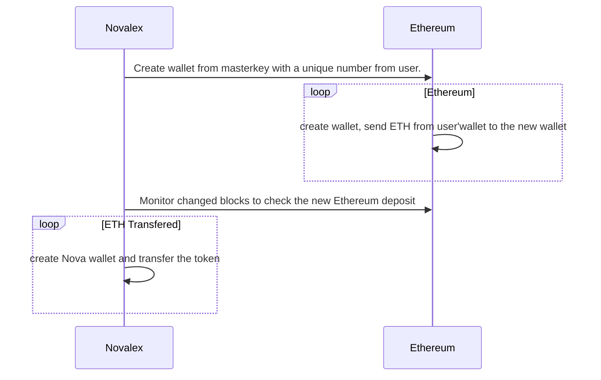

# Introduction

Nova DEX's provide an Admin API: a RESTful interface for operating and configuring your DEX.
The Admin API accepts `application/json` types on every endpoint

## List all markets

Fetch all markets with is_publish = true

`GET /markets`

<!-- tabs:start -->

#### **Bash**

```bash
curl "http://api.novalex.vn/markets"
```

#### **Golang**

```go
import (
	"encoding/json"
  "github.com/novaprotocolio/nova-scaffold-dex/backend/models"
)
markets := models.MarketDao.FindPublishedMarkets()
```

<!-- tabs:end -->

### Response

```json
{
  "status": "success",
  "data": [
    {
      "id": "HOT-DAI",
      "baseTokenSymbol": "HOT",
      "BaseTokenName": "HOT",
      "baseTokenAddress": "0x224E34A640FC4108FABDb201eD85D909059105fA",
      "baseTokenDecimals": 18,
      "quoteTokenSymbol": "DAI",
      "QuoteTokenName": "DAI",
      "quoteTokenAddress": "0xbc3524faa62d0763818636d5e400f112279d6cc0",
      "quoteTokenDecimals": 18,
      "minOrderSize": "0.001",
      "pricePrecision": 5,
      "priceDecimals": 5,
      "amountDecimals": 5,
      "makerFeeRate": "0.003",
      "takerFeeRate": "0.001",
      "gasUsedEstimation": 1,
      "isPublished": true
    }
  ]
}
```

## List all trades of a market

Find all trades of the given market with marketID

`GET /markets/:marketID/trades`

<!-- tabs:start -->

#### **Bash**

```bash
curl "http://api.novalex.vn/HOT-DAI/trades"
```

#### **Golang**

```go
import (
	"encoding/json"
  "github.com/novaprotocolio/nova-scaffold-dex/backend/models"
)
trades := models.TradeDao.FindTradesByMarket(marketID, yesterday, time.Now())
```

<!-- tabs:end -->

### Response

```json
{
  "status": 0,
  "desc": "success",
  "data": {
    "count": 1,
    "trades": [
      {
        "id": 2,
        "transactionID": 2,
        "transactionHash": "0xf5da75e0fc3983931fb9156b4c19455aeaa9290c84b094c9a2f6ff797467b44f",
        "status": "successful",
        "marketID": "HOT-DAI",
        "maker": "0x126aa4ef50a6e546aa5ecd1eb83c060fb780891a",
        "taker": "0xc3f12b4240f88fcefcdbbc89357decb3f8eac0cd",
        "takerSide": "buy",
        "makerOrderID": "0x1332d13b2118f23df3cd22399ea0f6f69e894ce19995f47e1a2aaa8cab309fa7",
        "takerOrderID": "0x4c062a36719ac2ee11ebb4ed7cdded1b6f994db700c90d5e6c85725d32792be9",
        "sequence": 0,
        "amount": "5",
        "price": "1.02",
        "executedAt": "1970-01-01T00:00:00Z",
        "createdAt": "2019-05-31T04:34:42.828811Z",
        "updatedAt": "2019-05-31T04:34:47.752712Z"
      }
    ]
  }
}
```

## Create a market

Create a market, a market is a token - token pair. default isPublished value is published

- minOrderSize: the order size must be greater than this value
- priceDecimals: the number of numbers after the dot in the order value.
- makerFeeRate: if you add the liquidity to the market, you are a maker, this fee is charged to maker
- takerFeeRate: if you take the liquidity from the market, you are a taker, this fee is charged to taker

`POST /markets`

### Request body

```js
{
	"id": "HOT-WETH",                                                  // required
	"baseTokenAddress": "0x224E34A640FC4108FABDb201eD85D909059105fA",  // required
	"quoteTokenAddress": "0xbc3524faa62d0763818636d5e400f112279d6cc0", // required
	"minOrderSize": "0.001",                                           // optional default 0.01
	"pricePrecision": 5,                                               // optional default 5
	"priceDecimals": 5,                                                // optional default 5
	"amountDecimals": 5,                                               // optional default 5
	"makerFeeRate": "0.003",                                           // optional default 0.003
	"takerFeeRate": "0.001",                                           // optional default 0.001
	"gasUsedEstimation": 1,                                            // optional default 190000
	"isPublished": true                                                // optional default false
}
```

### Response on success

```json
{
  "status": "success"
}
```

### Response on fail

```json
{
  "status": "fail",
  "error_message": "reason"
}
```

## Approve market tokens

Approve a market to be published by erc20

`POST /markets/approve`

### Query Parameters

| Parameter | Default  | Description     |
| --------- | -------- | --------------- |
| marketID  | HOT-WETH | The token pair. |

### Response on success

```json
{
  "status": "success"
}
```

### Response on fail

```json
{
  "status": "fail",
  "error_message": "reason"
}
```

## Get a market

Get a market

`GET /markets`

### Request body

```json
{
  "id": "HOT-WETH",
  "minOrderSize": "0.001",
  "isPublished": true
}
```

### Response on success

```json
{
  "status": "success"
}
```

## GetOrderBook

Get a GetOrderBook

`GET /markets/:marketID/orderbook`

### Request body

```json
{
  "id": "HOT-WETH",
  "minOrderSize": "0.001",
  "isPublished": true
}
```

### Response on success

```json
{
  "status": "success"
}
```

### Response on fail

```json
{
  "status": "fail",
  "error_message": "reason"
}
```

## Update a market

Update a market, change property value of a market

`PUT /markets`

### Request body

```json
{
  "id": "HOT-WETH",
  "minOrderSize": "0.001",
  "isPublished": true
}
```

### Response on success

```json
{
  "status": "success"
}
```

### Response on fail

```json
{
  "status": "fail",
  "error_message": "reason"
}
```

---

# Errors

The Admin API uses the following error codes:

| Error Code | Meaning                                                                                     |
| ---------- | ------------------------------------------------------------------------------------------- |
| 400        | Bad Request -- Your request sucks                                                           |
| 401        | Unauthorized -- Your API key is wrong                                                       |
| 403        | Forbidden -- The kitten requested is hidden for administrators only                         |
| 404        | Not Found -- The specified kitten could not be found                                        |
| 405        | Method Not Allowed -- You tried to access a kitten with an invalid method                   |
| 406        | Not Acceptable -- You requested a format that isn't json                                    |
| 410        | Gone -- The kitten requested has been removed from our servers                              |
| 418        | I'm a teapot                                                                                |
| 429        | Too Many Requests -- You're requesting too many kittens! Slow down!                         |
| 500        | Internal Server Error -- We had a problem with our server. Try again later.                 |
| 503        | Service Unavailable -- We're temporarially offline for maintanance. Please try again later. |

### Deposit process

Process

Ethereum Nova



Deposit Process:

Blockchain Address:

    Blockchain address
    Confirm block (30)
    Minimum Amount

Relayer:

    Relayer address: for user to send to.
    MasterKey: use to create Relayer wallets on user platform (Etherium)
    Market Allowance: which coin pair can be traded.

- For Ethereum

  User wants to send x ETH to deposit to NovaChain through a Relayer. base on user profile and master key of the relayer, create a Ethereum wallet and ask the user send ETH to that wallet address.

  Monitor that wallet address from Ethereum changed blocks, if there is any deposit amount to that address, record it as the user's deposit.

  Create a NovaChain wallet for the user. Transfer the corresponding Nova to user's wallet.
