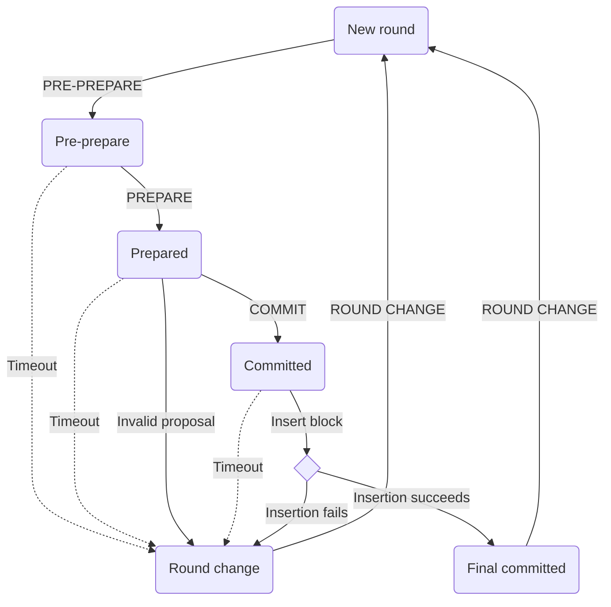

# Istanbul byzantine fault tolerant consensus protocol

## Terminology

- **Validator**: Block validation participant.
- **Proposer**: A block validation participant that is chosen to propose block in a consensus round.
- **Round**: Consensus round. A round starts with the proposer creating a block proposal and ends with a block commitment or round change.
- **Proposal**: New block generation proposal which is undergoing consensus processing.
- **Sequence**: Sequence number of a proposal. A sequence number should be greater than all previous sequence numbers. Currently each proposed block height is its associated sequence number.
- **Backlog**: The storage to keep future consensus messages.
- **Round state**: Consensus messages of a specific sequence and round, including pre-prepare message, prepare message, and commit message.
- **Consensus proof**: The commitment signatures of a block that can prove the block has gone through the consensus process.
- **Snapshot**: The validator voting state from last epoch.

## Consensus

- All of the validators can be seen as clients.
- A proposer will be continously selected in each round to create block proposal for consensus.
- 3-phase consensus: PRE-PREPARE, PREPARE, and COMMIT. The system can tolerate at most of **F** faulty nodes in a **N** validator nodes network, where **N = 3F + 1**.
- While receiving **2F + 1** of **PREPARE** messages, the validator enters the state of **PREPARED**, and then broadcasts **COMMIT** message. Lastly validators wait for **2F + 1** of **COMMIT** messages to enter **COMMITTED** state and then insert the block to the chain.
- We calculate the block hash by excluding the **COMMIT** signatures part. Therefore, we can still keep the block/block hash consistency as well as put the consensus proof in the block header.

### Constants

We define the following constants:

- **EPOCH_LENGTH**: Number of blocks after which to checkpoint and reset the pending votes.
  - Suggested 30000 for the testnet to remain analogous to the main net ethash epoch.
- **REQUEST_TIMEOUT**: Timeout for each consensus round before firing a round change in millisecond.
- **BLOCK_PERIOD**: Minimum timestamp difference in seconds between two consecutive blocks.
- **PROPOSER_POLICY**: Proposer selection policy, defaults to round robin.
- **ISTANBUL_DIGEST**: Fixed magic number _0x63746963616c2062797a616e74696e65206661756c7420746f6c6572616e6365_ of mixDigest in block header for Istanbul block identification.
- D**EFAULT_DIFFICULTY**: Default block difficulty, which is set to 0x0000000000000001 .
- **EXTRA_VANITY**: Fixed number of extra-data prefix bytes reserved for proposer vanity.
  - Suggested 32 bytes to retain the current extra-data allowance and/or use.
- **NONCE_AUTH**: Magic nonce number 0xffffffffffffffff to vote on adding a validator.
- **NONCE_DROP**: Magic nonce number 0x0000000000000000 to vote on removing a validator.
- **UNCLE_HASH**: Always _Keccak256(RLP([]))_ as uncles are meaningless outside of PoW.
- **PREPREPARE_MSG_CODE**: Fixed number 0. Message code for **PREPREPARE** message.
- **COMMIT_MSG_CODE**: Fixed number 1. Message code for **COMMIT** message.
- **ROUND_CHANGE_MSG_CODE**: Fixed number 2. Message code for **ROUND CHANGE** message.

We also define the following per-block constants:

- **BLOCK_NUMBER**: Block height in the chain, where the height of the genesis block is 0.
- **N**: Number of authorized validators.
- **F**: Number of allowed faulty validators.
- **VALIDATOR_INDEX**: Index of the block validator in the sorted list of current authorized validators.
- **VALIDATOR_LIMIT**: Number of validators to pass an authorization or de-authorization proposal.
  - Must be _floor(N / 2) + 1_ to enforce majority consensus on a chain.

### States

- **NEW ROUND**: Proposer send new block proposal, validators wait for **PRE-PREPARE** message.
- **PRE-PREPARED**: A validator has received **PRE-PREPARE** messages and broadcasts **PREPARE** messages, then waits for **2F + 1** of **PREPARE** or **COMMIT** messages.
- **PREPARED**: A validator has received **2F + 1** of **PREPARE** messages and broadcasts **COMMIT** messages, then waits for **2F + 1** of **COMMIT** messages.
- **COMMITTED**: A validator has received **2F + 1** of **COMMIT** messages and is able to insert the proposed block into the blockchain.
- **FINAL COMMITTED**: A new block is successfully inserted into the blockchain and the validator is ready for the next round.
- **ROUND CHANGE**: A validator is waiting for **2F + 1** of **ROUND CHANGE** messages on the same proposed round number.

### Transitions

- **NEW ROUND** -> **PRE-PREPARED**:

  - Proposer collects transactions from txpool.
  - Proposer generates a block proposal and broadcasts it to validators, then enter the **PRE-PREPARED** state.
  - Each validator enters **PRE-PREPARED** upon receiving the **PRE-PREPARE** message message with the following conditions:

    - Block proposal is from the valid proposer
    - Block header is valid
    - Block proposal's sequence and round match the validator's state.

  - Validator broadcasts **PREPARE** messages to other validators.

- **PRE-PREPARED** -> **PREPARED**:

  - Validator receives **2F + 1** of valid **PREPARE** messages to enter **PREPARED** state. Valid messages conform to the following conditions:

    - Matched sequence and round.
    - Matched block hash.
    - Messages are from known validators.

  - Validator broadcasts **COMMIT** message upon entering **PREPARED** state.

- **PREPARED** -> **COMMITTED**:

  - Validator receives **2F + 1** of valid **COMMIT** message to enter **COMMITED** state. Valid messages conform the following conditions:
    - Matched sequence and round.
    - Matched block hash.
    - Messages are from known validators.

- **COMMITTED** -> **FINAL COMMITTED**:

  - Validator appends **2F + 1** commitment signatures to extraData and tries to insert the block into the blockchain.
  - Validator enter **FINAL COMMITTED** state when insertion succedds.

- **FINAL COMMITTED** -> **NEW ROUND**:
  - Validator pick a new proposal and starts a new round times.
