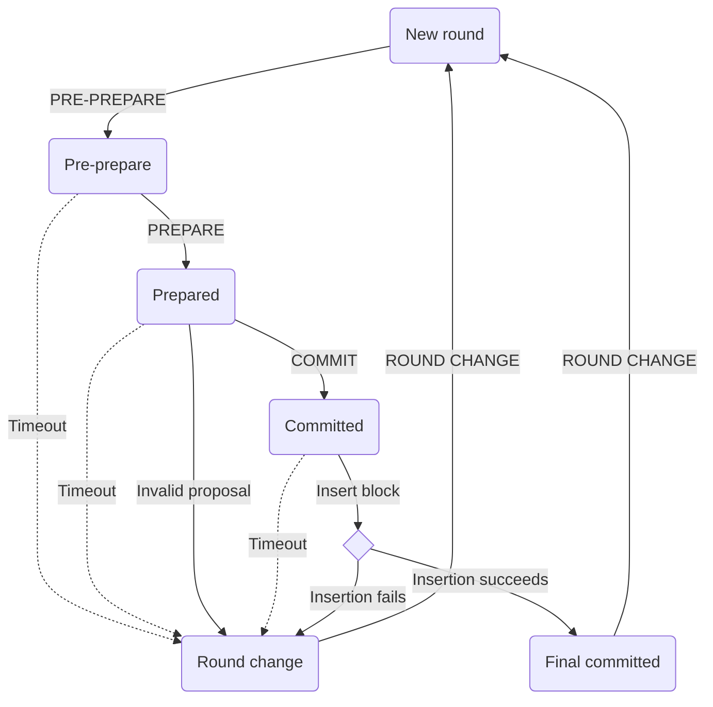

# Istanbul byzantine fault tolerant consensus protocol

```mermaid
graph TB
    A(New round) -->|PRE-PREPARE| B(Pre-prepare)
    B --> |PREPARE| C(Prepared)
    B -.-> |Timeout| C1(Round change)
    C -.-> |Timeout| C1
    C --> |Invalid proposal| C1
    C --> |COMMIT| D(Committed)
    D -.-> |Timeout| C1
    D --> |Insert block| I{ }
    I --> |Insertion fails| C1
    I --> |Insertion succeeds| E(Final committed)
    E --> |ROUND CHANGE| A
    C1 --> |ROUND CHANGE| A
    class A,E roundedClass
```
