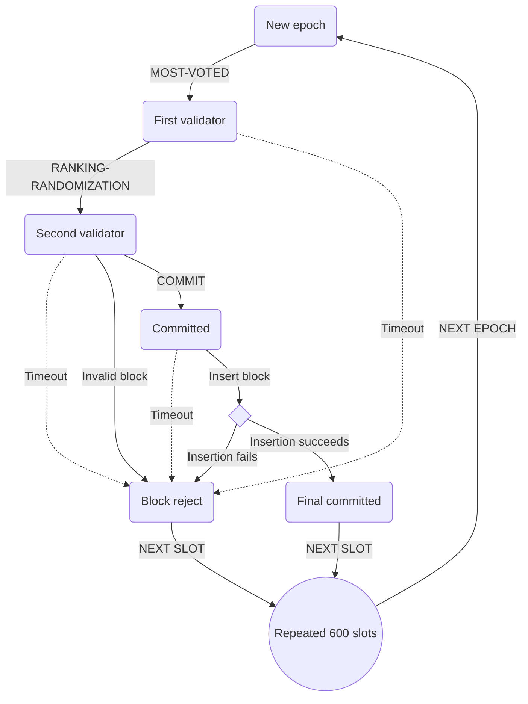
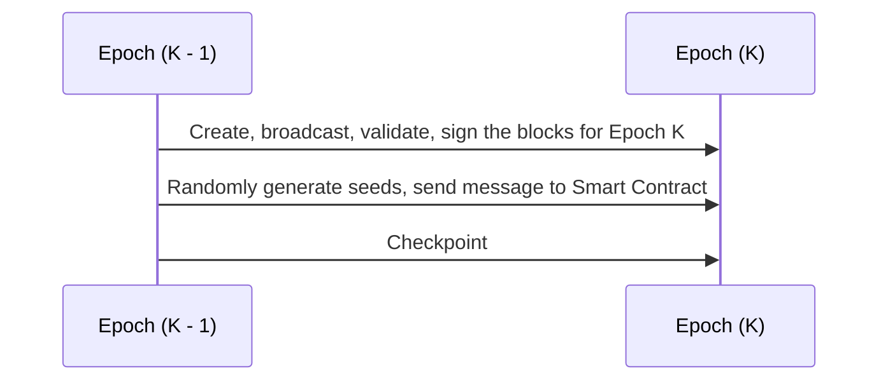

# Ranking Proof Of Stake Consensus



### Consensus Protocol

Block is created by block producer, namely masternode. First block creator is most voted one and the other is randomized with ranking to help confirm a block with 2 signatures. With randomization, we can reducing risks comming from paired masternodes trying to commit malicous blocks.

1. First validator: we pick the most-voted masternode as the first validator, to produce the block.
2. Second validator: in Proof of Stake, much like Proof of Authority, one block creator done, next masternode in the ring may be dishonest and then confirm it and create a next block. That is why we will pick the second one based on factors: **random number ∗ ranking coefficient**. Ranking coefficient is based on the total amount of deposit tokens that a note is voted for.

   $$
   [v_1]=
   \begin{bmatrix}
   V_{1.1}^e \\
   V_{1.2}^e \\
   \vdots \\
   V_{1.n-1}^e \\
   V_{1.n}^e
   \end{bmatrix}
   $$

   Let m be the number of masternodes, n be the number of slots in an epoch. in order to randomly generate the block verifier for the next epoch e + 1, the process is perform as the following steps:

   - **Step 1: Random number generation:** At the beginning of epcho e, each masternode $V_i$ will securely create an array of n + 1 special random numbers $Recommend_i$ = $[r_{i.1},r_{i.2},...,r_{i.n},\theta_{i}]$ where $r_{i,k} \in [1,...,m]$ indicating the recommendation of ordered list of block verifiers for the next epoch of $V_i$, and $\theta_i \in \lbrace -1,0,1 \rbrace$ is used for increasing the unpredictability of the random numbers.
     Then each masternode has to encrypt the array $Recommend_i$ using a secret key $SK_i$, say $Secret_i = Encrypt(Recommend_i, SK_i)$ as the encrypted array. Next each masternode forms a "lock" message that contains the encrypted array, signs off this message with its blockchain's private key along with the corresponding epoch index. By doing this, every masternode can check who created this lock message through ECDSA verification scheme. Finally each node sends their lock message with its signature and public key to the smart contract stored in blockchain, so that each masternode can collect and know the locks from all other masternodes.

   - **Step 2: Recovery Phase:** The recovery phase is for every node to reveal its previous lock message so that other nodes can get to know the secret array it has sent before. This happens when all masternodes have sent their lock messages or a certain timeout event occurs. Each masternode then opens its lock message by sending unlock message to the smart contract. Eventually a masternode has both locks and unlocks of others. If some electors are adversaries which might publish it's lock but intend not to send the corresponding unlock, other masternodes can ignore by simple setting all its random values to 1 as default.

   - **Step 3: Assembled Matrix and Computation Phase:** At the point of slot $n^th$ of the epoch e, the secret arrays $Secret_i$ will be decrypted by each masternode and return the plain version of $Recommend_i$. Each tuple of the first n numbers of each $V_i$ will be assembled as the $i^th$ column of an n x m matrix. All the last number $\theta_i$ forms a m x 1 matrix. Then each node will compute the block verifiers ordered list by some mathematical operations as explained below. The result is a matrix n x 1 indicating the order of block verifiers for the next epoch e + 1.

   The Second Masternode/Block Verifier: Each node computes the common array $v_2$ for the order of the block verifiers by the following steps as in Equation 1. Then, $v_2$ is obtained by modulo operation of element values of $v^{\prime}_2$ as in Equation 2.

   $$
   \begin{alignedat}{1}
   [v^{\prime}_{2}] =
   \begin{bmatrix}
   v_{2.1}^{e+1} \\
   v_{2.2}^{e+1} \\
   \vdots \\
   v_{2.n-1}^{e+1} \\
   v_{2.n}^{e+1}
   \end{bmatrix} =
   \begin{bmatrix}
   r_{1.1} & r_{2.1} & \dots & r_{m.1} \\
   r_{1.2} & r_{2.2} & \ddots & \vdots \\
   r_{1.3} & \ddots & \ddots & r_{m.3} \\
   \vdots & \ddots & r_{m-1.n-1} & r_{m.n-1} \\
   r_{1.n} & \dots & r_{m-1.n} & r_{m.n}
   \end{bmatrix}
   \begin{bmatrix}
   \theta_1 \\
   \theta_2 \\
   \theta_3 \\
   \vdots \\
   \theta_m
   \end{bmatrix} \;\;\;\;\;\;\;\;\;\;\;\;\;\;(1) \\ \; \\ \; \\
   [v_2] = [v^{\prime}_{2} \space\space mod \space m] =
   \begin{bmatrix}
   |v_{2.1}^{e+1}| & mod \space m \\
   |v_{2.2}^{e+1}| & mod \space m \\
   \vdots \\
   |v_{2.n}^{e+1}| & mod \space m
   \end{bmatrix} \;\;\;\;\;\;\;\;\;\;\;\;\;\;\;\;\;\;\;\;\;\;(2)
   \end{alignedat}
   $$

   The final randomized ranking list is as follow:

   $$
   r_i = \dfrac {t_i}{\textstyle\sum_{i=1}^n t_i} \\ \; \\ \; \\
   [v_2] =
   \begin{bmatrix}
   |v_{2.1}^{e+1}| \space \times \space r_1 \\
   |v_{2.2}^{e+1}| \space \times \space r_2 \\
   \vdots \\
   |v_{2.n}^{e+1}| \space \times \space r_n
   \end{bmatrix}
   $$

### Ranking algorithm

The algorithm is as following:

```python
def simulator(nodes):
    if len(nodes) == 0:
        print("number of node is 0, return")
        return
    #select leader

    #random array with length is number of canidate of leader
    rand_arr = np.random.rand(len(nodes)).tolist()
    for i in range(len(rand_arr)):
        nodes[i][POINT] += rand_arr[i]

    #select lead node
    index_of_leader = -1
    maximum = -1
    for i in range(len(rand_arr)):
        if rand_arr[i] > maximum:
            index_of_leader = i
            maximum = rand_arr[i]
    if index_of_leader == -1:
        print("index of leader is -1, return")
        return
    nodes[index_of_leader][NUMBER_OF_VOTE] += 1

    #select validator

    point_arr = []
    total = 0
    for i in range(len(nodes)):
        if i != index_of_leader:
            total += nodes[i][POINT]
            point_arr.append(nodes[i][POINT])
    mean = total/(len(nodes) - 1)

    rand_ranking = np.random.rand(len(nodes) -1).tolist()


    index_of_validator = -1
    maximum = -1
    for i in range(len(rand_ranking)):
        if mean != 0:
            rank_point = rand_ranking[i] * point_arr[i] * 1/mean
        else:
            rank_point = rand_ranking[i] * point_arr[i]
        if rank_point > maximum:
            index_of_validator = i
            maximum = rank_point

    if index_of_validator == -1:
        print("index of validator is -1, return")
    if index_of_validator >= index_of_leader:
        nodes[index_of_validator + 1][NUMBER_OF_VALIDATOR] += 1
    else:
        nodes[index_of_validator][NUMBER_OF_VALIDATOR] += 1
```




Because the order of block creation masternodes is pre-determined for each epoch, random/arbitrary forks are hardly happened. As long as the number of attackers is less than $\frac 1 4$ the number of masternodes, block is finallized and no chance to create longer valid chain.

The random order of masternode array is then multiply with a rank array to get the final ordered list.
By applying ranking algorithm ( AI enhanced ) we can solve the most vexing limitation and increase TPS close to Visa.
