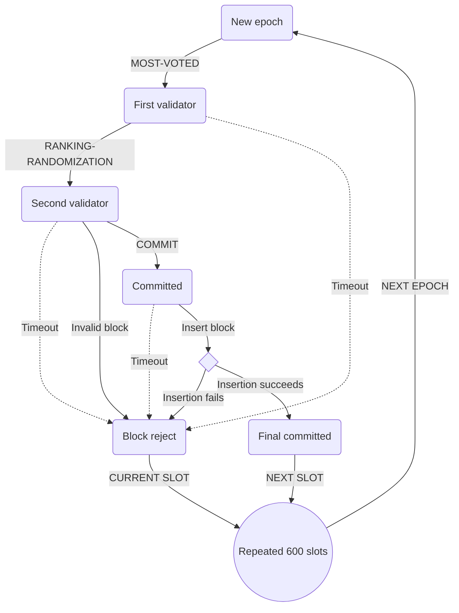
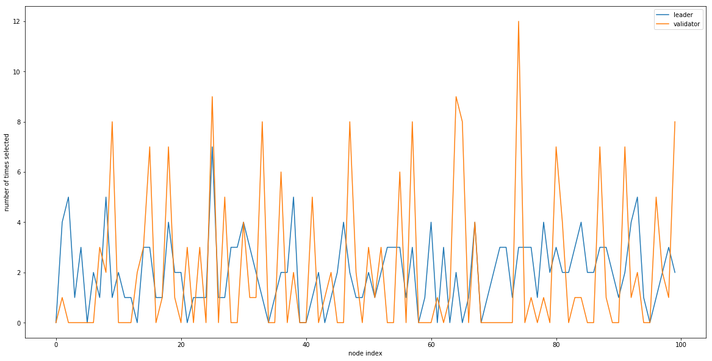
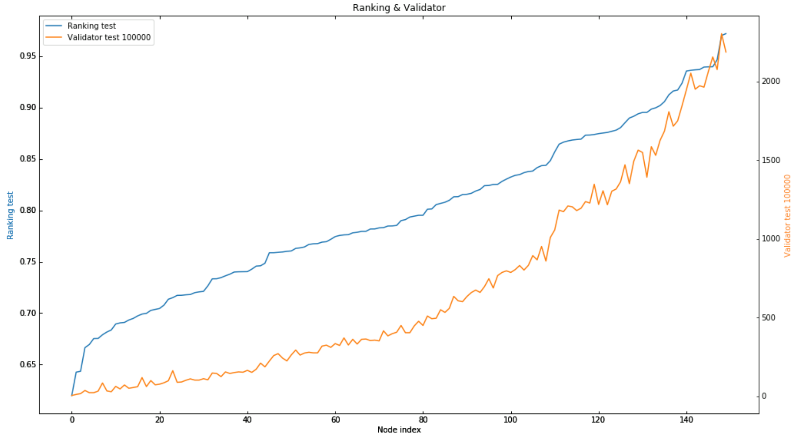
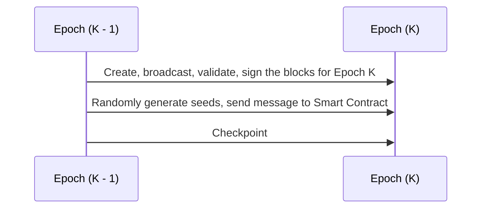
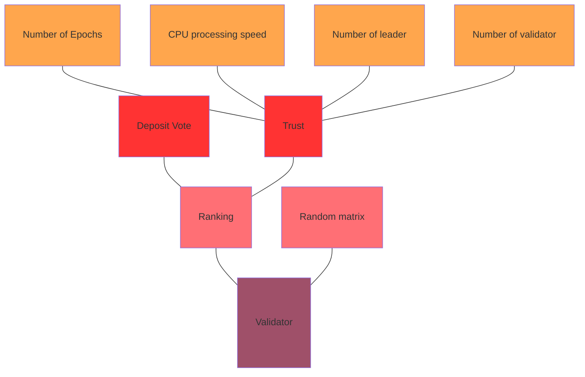

# Abstract
<<<<<<< HEAD
We introduce a new blockchain architecture and concept that is practical in terms of operability, scalable and economically sensible. Novalex blockchain is a public EVM-compatible blockchain that focuses on maintaining an instantaneous confirmation time, high level of security and a sensible low-fee, high volume compensation scheme. We use a ranking proof of stake voting consensus for increased security and fast confirmation. Our ranking-bias voting mechanism provides a fair compensation scheme for our masternodes, thus encouraging each masternode to improve on its stake and performance for maximum compensation. This benefits the entire ecosystem through healthy competition and high masternode engagement. Using our robust ecosystem, we eventually aim to built practical decentralised applications that will generate a revenue stream for our coin holders providing immediate dividends unlike an Equity underlying which normally pay quaterly dividends. We do so in an environment where decision making is decentralised unlike the current norm where power in concentrated in a single agency. This will greatly help the blockchain ecosystem by conceptually bringing it closer to mainstream business and finance, facilitating the evolution to create a decentralised economic hinterland where power is shared rather concentrated in agency.
=======

We introduce a new blockchain architecture and concept that is practical in terms of operability, scalable and economically sensible. Novalex blockchain is a public EVM-compatible blockchain that focuses on maintaining an instantaneous confirmation time, high level of security and a sensible compensation scheme. We used a ranking proof of stake consensus for increased security and fast confrimation. Our ranking-bias voting mechanism provides a fair compensation scheme for our masternodes, thus encouraging each masternode to improve on its stake and performance for maximum compensation. This benefits the entire ecosystem through healthy competition and high masternode engagement. Using our robust ecosystem, we eventually aim to built practical decentralised applications that will generate a revenue stream for our coin holders providing immediate dividends unlike an Equity underlying which normally pay quaterly dividends. We do so in an environment where decision making is dencentralised unlike the current norm where power in concentrated in a single agency. This will greatly help the cryptocurrency ecosystem by conceptually bringing it closer to mainstream finance and ultimately gaining institutional acceptance in a new world where decentralised
>>>>>>> e49955b8e707274a45f7c25ebc6f62bded9e3b04

# Introduction
The cryptocurrency market has seen its share of bust and boom. The entire ecosystem have been littered with hacks and fraud giving it an undesired reputation. Critics have long profess that cryptocurrencies have no practical use, do not generate revenue and thus possess no intrinsic value. To address these issues, Novalex aims to create a new age blockchain architecture that is pushing the boundaries of decentralisation. Our focus is not only on building the underlying blockchain technology. We also leverage the technology to build useful DApps that transcends the journey towards economic decentralisation where top and profitable business applications are built. We aim to build a blockchain that generates a revenue stream just like an conventional Equity underlying albeit in a different time scale. Our token will then used as a medium for reward, payment or transactions  [link][1]

Bitcoin was created in 2008 when Satoshi Nakamoto         

## A World of Centralised Institutions
The argument with respect to the benefits and detriments of centralisation vs decentralisation has been evolving for centuries. The studies of Social and Behavioral Sciences with respect to these structures of society is well studied and documented. Since the Neolithic Age, human or its ancestors have began a period of centralisation. Communities became cities and cities became empires. As people came together it became more difficult to maintain trust and harmony, leading to a collaspe of society, hence arises a need to form central institutions of governance and gatekeepers. 

## A Decentralised Future

# Architecture

<<<<<<< HEAD


## Novalex Blockchain
=======
# Novalex Blockchain
>>>>>>> e49955b8e707274a45f7c25ebc6f62bded9e3b04


### Design

Novalex is a public EVM-compartible blockchain that allows you to create blocks within 1 second, with some advantanges:

- allowing tokens holders vote for the block producers
- randomization with ranking for security guarantees
- built-in orderbook engine as a protocol

We propose Ranking Proof-Of-Stake consensus, a Proof-Of-Stake based blockchain with voting mechanisim and ranking algorithm. Top 68 block producers are selected by continous voting of NOVA token holders. Each Nova token holder is given the opportunity to give 80 votes, corresponding to power of staked tokens.

### Novalex incentivization

Novalex is produced and maintained by a set of masternodes in a consistent manner through the Novalex consensus. These masternodes are full nodes that hold NOVA. For a coin holder to become a masternode, it must hold a mininum amount of coin and be one of the most voted candidates in the system. The voting phase is credited through a Voting Dapp that allows coin-holders to send NOVA through the smart contract.

Double validation with ranking is added to decrease the probability of having invalid blocks in the blockchain.

After depositing 80 000 NOVA to the Voting Smart Contract, the the depositors are listed as masternode candidates in the Voting DApp, which allows coin-holders to vote for them by sending NOVA to the smart contract.
The list is sorted dynamically based on voted coins. We track CPU/Memory as workload, number of signed block as performance, last signed block as last activity, then candidate is chosen based on the performance factor. All masternodes have to race for their positions so that all weak nodes eventually will be eliminated. Masternode is
locked for 1 month after demoted.

After 600 blocks, a checkpoint block is created, the masternode who takes turn in the circular has to scan all of the created blocks in the epoch to count number of signatures.

- 60% of reward called infastructure reward goes to masternodes
- staking reward: 30% goes to the pool of all voters for that Masternode which is shared proportionally based on the token stake.
- 10% goes to development funding account.

Novalex has a built-in orderbook engine so that relayers can launch a decentralized exchange without maintaining an off-chain database.

### Smart Contract

### Reward Mechanism

# Ranking Proof Of Stake Consensus



### Randomness in blockchain

Consensus protocols are actually random number generators, but public blockchains rely on a way to determine the next producers. This election process should have 3 properties:

1. Fairness: anyone can have a chance at creating a block, but proportional to some effort invested.
2. Incentive-based: Participant should gain a advantage from being chosen as the block producer and be incentivized to be honestly.
3. Non-determinism: The next block producer should not be known in advance.

### Consensus Protocol

Block is created by block producer, namely masternode. First block creator is most voted one and the other is randomized with ranking to help confirm a block with 2 signatures. With randomization, we can reducing risks comming from paired masternodes trying to commit malicous blocks.

1. First validator: we pick the most-voted masternode as the first validator, to produce the block.
2. Second validator: in Proof of Stake, much like Proof of Authority, one block creator done, next masternode in the ring may be dishonest and then confirm it and create a next block. That is why we will pick the second one based on factors: **random number ∗ ranking coefficient**. Ranking coefficient is based on the total amount of deposit tokens that a note is voted for.

   $$
   [v_1]=
   \begin{bmatrix}
   V_{1.1}^e \\
   V_{1.2}^e \\
   \vdots \\
   V_{1.n-1}^e \\
   V_{1.n}^e
   \end{bmatrix}
   $$

   Let m be the number of masternodes, n be the number of slots in an epoch. in order to randomly generate the block verifier for the next epoch e + 1, the process is perform as the following steps:

   - **Step 1: Random number generation:** At the beginning of epcho e, each masternode $V_i$ will securely create an array of n + 1 special random numbers $Recommend_i$ = $[r_{i.1},r_{i.2},...,r_{i.n},\theta_{i}]$ where $r_{i,k} \in [1,...,m]$ indicating the recommendation of ordered list of block verifiers for the next epoch of $V_i$, and $\theta_i \in \lbrace -1,0,1 \rbrace$ is used for increasing the unpredictability of the random numbers.
     Then each masternode has to encrypt the array $Recommend_i$ using a secret key $SK_i$, say $Secret_i = Encrypt(Recommend_i, SK_i)$ as the encrypted array. Next each masternode forms a "lock" message that contains the encrypted array, signs off this message with its blockchain's private key along with the corresponding epoch index. By doing this, every masternode can check who created this lock message through ECDSA verification scheme. Finally each node sends their lock message with its signature and public key to the smart contract stored in blockchain, so that each masternode can collect and know the locks from all other masternodes.

   - **Step 2: Recovery Phase:** The recovery phase is for every node to reveal its previous lock message so that other nodes can get to know the secret array it has sent before. This happens when all masternodes have sent their lock messages or a certain timeout event occurs. Each masternode then opens its lock message by sending unlock message to the smart contract. Eventually a masternode has both locks and unlocks of others. If some electors are adversaries which might publish it's lock but intend not to send the corresponding unlock, other masternodes can ignore by simple setting all its random values to 1 as default.

   - **Step 3: Assembled Matrix and Computation Phase:** At the point of slot $n^{th}$ of the epoch e, the secret arrays $Secret_i$ will be decrypted by each masternode and return the plain version of $Recommend_i$. Each tuple of the first n numbers of each $V_i$ will be assembled as the $i^{th}$ column of an n x m matrix. All the last number $\theta_i$ forms a m x 1 matrix. Then each node will compute the block verifiers ordered list by some mathematical operations as explained below. The result is a matrix n x 1 indicating the order of block verifiers for the next epoch e + 1.

   The Second Masternode/Block Verifier: Each node computes the common array $v_2$ for the order of the block verifiers by the following steps as in Equation 1. Then, $v_2$ is obtained by modulo operation of element values of $v^{\prime}_2$ as in Equation 2.

   $$
   \begin{alignedat}{1}
   [v^{\prime}_{2}] =
   \begin{bmatrix}
   v_{2.1}^{e+1} \\
   v_{2.2}^{e+1} \\
   \vdots \\
   v_{2.n-1}^{e+1} \\
   v_{2.n}^{e+1}
   \end{bmatrix} =
   \begin{bmatrix}
   r_{1.1} & r_{2.1} & \dots & r_{m.1} \\
   r_{1.2} & r_{2.2} & \ddots & \vdots \\
   r_{1.3} & \ddots & \ddots & r_{m.3} \\
   \vdots & \ddots & r_{m-1.n-1} & r_{m.n-1} \\
   r_{1.n} & \dots & r_{m-1.n} & r_{m.n}
   \end{bmatrix}
   \begin{bmatrix}
   \theta_1 \\
   \theta_2 \\
   \theta_3 \\
   \vdots \\
   \theta_m
   \end{bmatrix} \;\;\;\;\;\;\;\;\;\;\;\;\;\;(1) \\ \; \\ \; \\
   [v_2] = [v^{\prime}_{2} \space\space mod \space m] =
   \begin{bmatrix}
   |v_{2.1}^{e+1}| & mod \space m \\
   |v_{2.2}^{e+1}| & mod \space m \\
   \vdots \\
   |v_{2.n}^{e+1}| & mod \space m
   \end{bmatrix} \;\;\;\;\;\;\;\;\;\;\;\;\;\;\;\;\;\;\;\;\;\;(2)
   \end{alignedat}
   $$

   The final randomized ranking list is as follow, with **t<sub>i</sub>** is the total deposit tokens of **masternode i**:

   $$
   r_i = \dfrac {t_i}{\textstyle\sum_{i=1}^n t_i} \\ \; \\ \; \\
   [v_2] =
   \begin{bmatrix}
   |v_{2.1}^{e+1}| \space \times \space r_1 \\
   |v_{2.2}^{e+1}| \space \times \space r_2 \\
   \vdots \\
   |v_{2.n}^{e+1}| \space \times \space r_n
   \end{bmatrix}
   $$

### Ranking algorithm

The algorithm is as following:

```python

# chose a leader node by voting
def vote_leader_test(nodes):
    #random array with length is number of canidate of leader
    arr_random = np.random.rand(len(nodes)).tolist()
    #select lead node
    index_of_leader = -1
    maximum = -1
    arr_leader = []
    for i in range(len(nodes)):
        multi = nodes[i][NUMBER_OF_DEPOSIT] * arr_random[i]
        arr_leader.append(multi)
        if multi > maximum:
            index_of_leader = i
            maximum = arr_leader[i]
    nodes[index_of_leader][LEADER_TEST] += 1
    return index_of_leader

# Trust for each masternode
def trust(nodes, arr_speed, total_epoch):
    trust_max = 0
    speed_arg = sum(arr_speed)/len(nodes)
    # weight for Trust algorithm
    a,b,c,d = 0.25, 0.1, 0.3, 0.35
    for i in range(len(arr_deposit_vote)):
        # Trust algorithm
        trust = a*(nodes[i][NUMBER_OF_EPOCH]/total_epoch) + b*(
                nodes[i][SPEED]/speed_arg) + c*(
                nodes[i][LEADER]/nodes[i][NUMBER_OF_EPOCH]) + d*(
                nodes[i][VALIDATOR]/nodes[i][NUMBER_OF_EPOCH])
        nodes[i][TRUST] = trust
        if trust > trust_max:
            trust_max = trust
    return trust_max

# Ranking for each masternode
def ranking(nodes, arr_deposit_vote, trust_max, deposit_max):
    total_deposit = sum(arr_deposit_vote)
    a = 0.25
    for i in range(len(nodes)):
        vote_deposit_avg = arr_deposit_vote[i] / deposit_max
        trust_avg = nodes[i][TRUST] / trust_max
        nodes[i][RANKING] = a * vote_deposit_avg + (1-a) * math.sqrt(trust_avg)

# Random validator base on Ranking of each node
def choose_validator_test(nodes, leader):
    index_of_validator = -1
    maximum = -1
    arr_random = np.random.rand(len(nodes)).tolist()
    for i in range(len(arr_random)):
        if nodes[i][RANKING] == 0:
            point = arr_random[i]
        else:
            point = math.sqrt(nodes[i][RANKING]) * math.pow(arr_random[i],4)
        if point > maximum:
            maximum = point
            if i != leader:
                index_of_validator = i
    nodes[index_of_validator][VALIDATOR_TEST] += 1
    return index_of_validator
```

**Start running**

```python
trust_max = trust(nodes, arr_speed, total_epoch)
ranking(nodes, arr_deposit_vote, trust_max, deposit_max)

for i in range(len(nodes)):
    nodes[i][LEADER_TEST] = 0
    nodes[i][VALIDATOR_TEST] = 0
for i in range(500000):
    leader_test = vote_leader_test01(nodes)
    validator_test = choose_validator_test(nodes, leader_test)
nodes.sort(key=lambda x: x[RANKING])
```

**With 100 000 and 500 000 Epoch sample**  






Because the order of block creation masternodes is pre-determined for each epoch, random/arbitrary forks are hardly happened. As long as the number of attackers is less than $\frac 1 4$ the number of masternodes, block is finallized and no chance to create longer valid chain.

The random order of masternode array is then multiply with a rank array to get the final ordered list. By applying ranking algorithm ( AI enhanced ) we can solve the most vexing limitation and increase TPS close to Visa.

### Performance of Voting Mechanism



In the Novalex protocol blockchain, instead of using the random matrix to choose the masternode to be the validator, we use **Ranking** to select validator. Purpose to reduce the ability of the masternode which is less trusted to become validator. Our ranking builds based on two factors: **Deposit amount** and **reliability** of each masternode. Because we voted the leader based on the amount of deposit so we don't want the validator to depend too much on deposit and that should focus on reliability. In order to calculate ranking for each masternode, the system use weighted for two variables and will normalize the parameters to the same scale as $[0,1]$. Specifically, we will use the deposit of the masternode divided by the most deposited masternode (deposit[i] / max_deposit) and so on with trust (trust[i] / max_trust). In terms of reliability, we build on 4 main factors: the number of epochs that the node participates in, the CPU processing speed, the number of times to become the leader, the number of times to become the validator. Finally, we **multiply** the ranking matrix with the random matrix and choose the masternode that has the highest score to become the validator there

```python
trust = a*(nodes[i][NUMBER_OF_EPOCH]/total_epoch) + b*(
    nodes[i][SPEED]/speed_arg) + c*(
    nodes[i][LEADER]/nodes[i][NUMBER_OF_EPOCH]) + d*(
    nodes[i][VALIDATOR]/nodes[i][NUMBER_OF_EPOCH])
```

Finally, to select the masternode to become validator, we multiply the ranking with random function

```python
math.sqrt(nodes[i][RANKING]) * math.pow(arr_random[i],4)
```

# Application

### Financial Services: Decentralised Exchange

Novadex is a decentralized exchange protocol based on the TomoChain blockchain infrastructure that is built into the core of Novalex blockchain. That means Relayers do not have to worry about the decentralized protocol, or creating their own off-chain orderbook.

#### Advantages of Novadex protocol

- **Liquidity** : With novadex, there is only one tradable orderbook for every token, so coin holders do not have to deposit their tokens on multiple exchanges. And your trade history will be the same whether you are on the popular exchange or not.

- **Full decentralization** : The orderbook database, matching engine, and trade execution mechanism are decentralized.

- **Security** : Because the tokens are not stored centralized, if the relayer you are trading on disappear, you have no problem continue trading on other relayers. Beside that, using the same token can help traders avoid depositing their assets.

#### Incentives for Relayer operators

- Masternodes obtain incentives for doing the computation of order matching and trade execution. Another incentive is that relayer's operators can obtain the incentives via adding fees to the settlement smart contracts.

### Financial Services: KYC and AML Application

# Conclusion

# Appendix 1
Novalex Decentralised Cryptocurrency Exchange

#References
   

[1]: [Ethereum White Paper ](https://github.com/ethereum/wiki/wiki/White-Paper)  
[2]: [Evolving from Decentralization to Centralization ](https://hackernoon.com/evolving-from-decentralization-to-centralization-33e7db8aadd2)
[3]: [Bitcoin: A Peer-to-Peer Electronic Cash System](https://bitcoin.org/bitcoin.pdf)