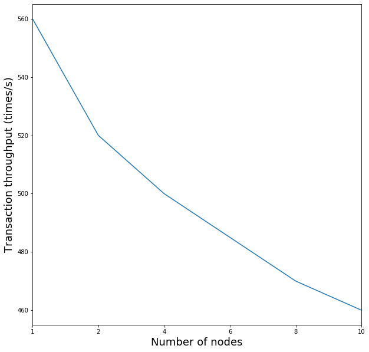
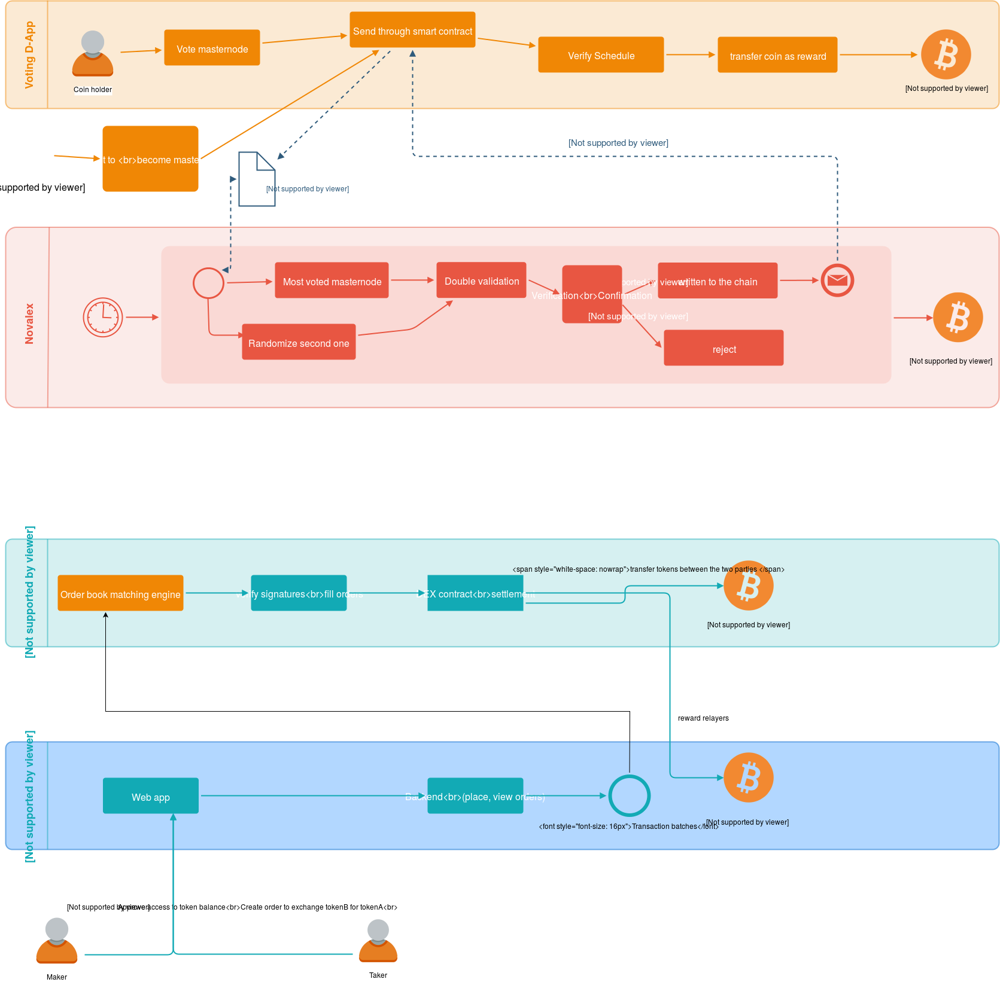
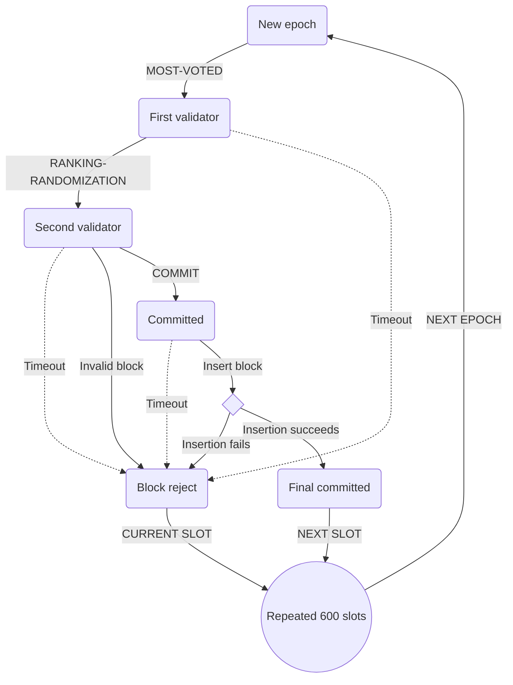
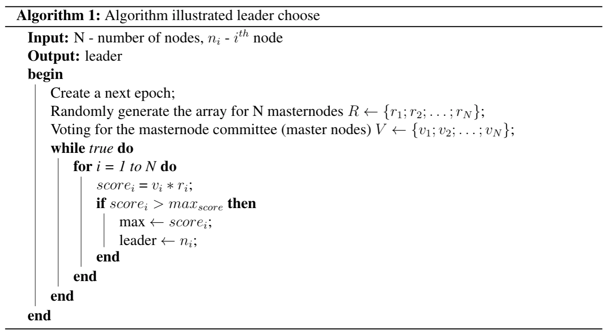
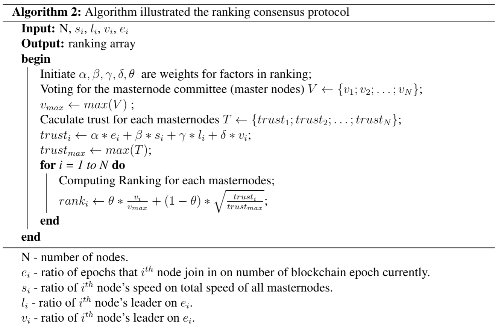
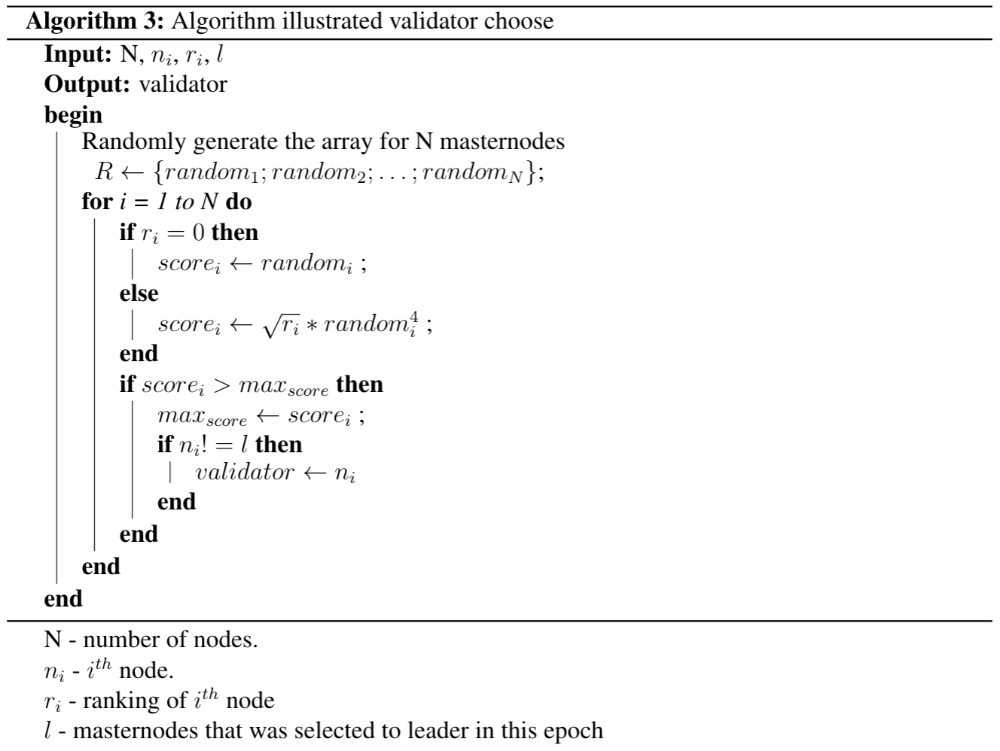
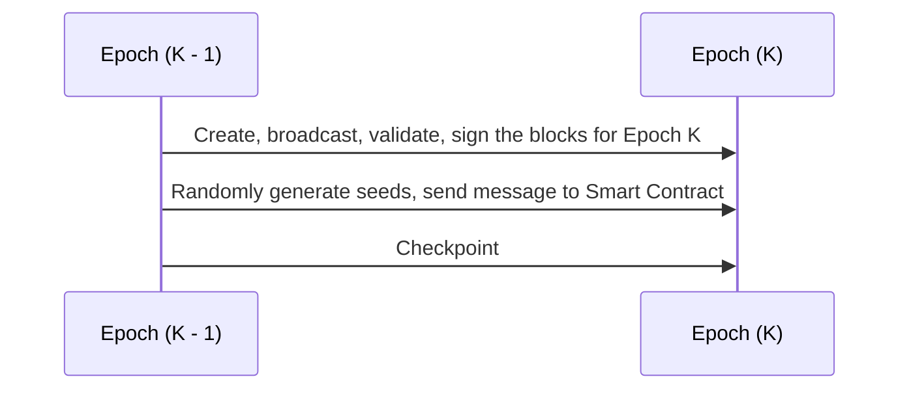
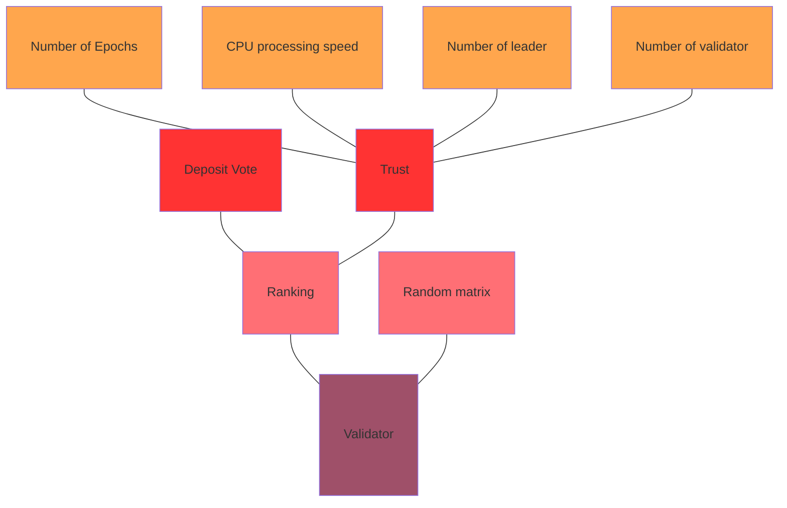

# Novalex Blockchian

# Abstract
We introduce a new blockchain architecture and concept that is practical in terms of operability, scalable and economically sensible. Novalex blockchain is a public EVM-compatible blockchain that focuses on maintaining an instantaneous confirmation time, high level of security and a sensible low-fee, high volume compensation scheme. We use a ranking proof of stake voting consensus for increased security and fast confirmation. Our ranking-bias voting mechanism provides a fair compensation scheme for our masternodes, thus encouraging each masternode to improve on its stake and performance for maximum compensation. This benefits the entire ecosystem through healthy competition and high masternode engagement. Using our robust ecosystem, we eventually aim to built practical decentralised applications that will generate a revenue stream for our coin holders providing immediate dividends unlike an Equity underlying which normally pay quarterly dividends. We do so in an environment where decision making is decentralised unlike the current norm where power in concentrated in a single agency. This will greatly help the blockchain ecosystem by conceptually bringing it closer to mainstream business and finance, facilitating the evolution to create a decentralised economic hinterland where power is shared rather than concentrated in a single agency. Although it is argued the main ethos for decentralization is non profit, it is a policy that is difficult to maintain and justify. Hence we offer a model of sustainable profitability where cost is low for consumers and profit is sustainable for our coinholders and masternodes. In this era of increasing populism, we build our ecosystem based on a philosophy of responsible capitalism.

# Introduction

### BlockChain and Cryptocurrency
There is some confusion outside the walls of the industry as to what is the difference between blockchain and cryptocurrency are. In very simple terms, blockchain is the distributed ledger technology where information is bundled into blocks. These blocks are then verified in a trustless peer-to-peer network where the rules of engagement are predetermined through a consensus algorithm agreed in advance. Since the blockchain technology that administered Bitcoin [link][3], blockchain technology have evolved steadily irregardless of the health of the cryptocurrency market as an asset class. Since Bitcoin in 2008, we have seen altcoins listed using different variations of the proof-of-work concept. However since 2012, proof of stake emerged as competitor concept where transactions times were lowered and the scalability problem was under control dues to its low energy consumption. Since then more advanced variations of the PoS technology have been created and the possibility of creating useful and sustainable application are now a practical possibility.

While blockchain represents the technology, Cryptocurrency represents a medium for the transfer of value and also a measure of remumeration for the 'work' done within each system and blockchain. The cryptocurrency market has seen its share of bust and boom. Since its advent, the cryptocurrency market have gone through 3 main cycles of peak and trough. In the most current rally, the total market capitalization of all cryptocurrencies was circulating near USD\$1 trillion. Since then, it has been fallen to around USD\$200 billion and the market have been stagnating around that level. Cryptocurrencries are known to be extremely volatile and in all 3 troughs, prices have crashed more than 80% from it peak in a relatively short amount of time. The entire ecosystem have been littered with hacks and fraud giving it an undesired reputation. Critics have long profess that cryptocurrencies have no practical use, do not generate revenue and thus possess no intrinsic value. However as the crypotocurrency market has grown in size and Government around the world To address these issues, Novalex aims to create a new age blockchain architecture that is pushing the boundaries of decentralisation. Our focus is not only on building the underlying blockchain technology. We also leverage the technology to build useful DApps that transcends the journey towards economic decentralisation where top and profitable business applications are built. We aim to build a blockchain that generates a revenue stream just like a conventional Equity underlying albeit in a different line. Our token will then used as a medium for reward, payment or transactions [link][1]

### A World of Centralised Institutions

The argument with respect to the benefits and detriments of centralisation vs decentralisation has been evolving for centuries. The studies of Social and Behavioral Sciences with respect to these structures of society is well studied and documented. Since the Neolithic Age, human or its ancestors have began a period of centralisation. Communities became cities and cities became empires. As people came together it became more difficult to maintain trust and harmony, leading to a collapse of society, hence arises a need to form central institutions of governance and gatekeepers. Since the last end of the last century, in the era of gobalisation, the speed and scale of centralisation have gathered pace and it has resulted in great powers being wielded by few individuals both socially and economically. This was regarded as an improvement in the spirit of humanity as the world got richer and millions were lifted of poverty. However one collateral effect of this global phenomenon is the increased divide between the rich and the poor. This has resulted in a wave of political populism and see countries become increasingly protectionist. As such, we may begin to see a world that is beginning the reverse the trend of centralisation and globalisation.  

### A Decentralised Future

In 2008, Satoshi Nakamoto first published the papar for an electronic cash system which resulted in the creation of the Bitcoin blockchain in the beginning of 2009. From there, the concept of using a blockchain for electonic cash have steadily evolved. Soon after the creation of Bitcoin, other  

### Evolution of Blockchain Architecture

### Scalability

Today, Ethereum processes roughly 500,000 transactions per day, and at full capacity, can process about 13 transactions per second. While these transactions don’t require a third party to validate them, centralized counterparts can process transactions much more efficiently. For example, Visa’s payment network processes 150 million transactions per day — orders of magnitude more than any decentralized blockchain network has been able to achieve. The main reason behind Ethereum’s scalability bottleneck is that each node in the network has to process each transaction, so to increase the performance, we need to limit the number of nodes that processing transactions.

- give up on scaling individual blockchains, and instead assume that applications will be split among many different chains. It can increase throughput, but at a cost of security.
- increase size limit: if one goes too far, the network will start to rely on a very small number of supercomputers running the blockchain.
- so to make exchange become decentralized, we rely on smart contracts, but it is limited, that's why we integrated into blockchain core

As mentioned above, scalability issue is really a big deal in the blockchain technology area.
Novalex is the project that applying the off-chain solution by creating a private blockchain with a fixed number of masternodes that performs faster and better especially for decentralized exchange applications.

### Security Vs Throughput

- contracts have bugs => should not build a big application entirely in smart contracts
- pseudo random number has bugs, based on block variables, block hash,
  we used commit-reveal approach (nobody knows each other's seeds so the result is truly random)=> safer implementation (randomized leader election)
- each party is paid a reward for participation (via voting mechanisim)
- the limit of smart contracts: each operation requires gas => run out of gas
- smart contract platforms are just one blockchain with a single, shared network. That puts a strict limit on the total transactions that the network can process in any given second. With a private ethereum blockchain, the maximum TPS can process is around 600.
- So by moving order message at the blockchain layer, we can achive a higher throughput at 2000.

# Novalex Architecture

The Novalex blockchain architecture consist of several modules in our core layer including our masternode configuration, consensus mechanism, token account management. For simplicity, solidity is chosen as a preferred language for smart contracts due to its overiding popularity, however we also provide support for python, Javascript and will aim to also support C++ and powercell in the near future. Novalex uses a ranking proof of stake voting mechanism to ensure a high level of security and fair compensation scheme.

### What is Novalex Blockchain?

Blockchain is a decentralized distributed database or ledger. 'Decentralization' implies that the application or service continues to be available and usable even if a server or a group of servers on a network crashes or are not available. 'Distributed' implies that any server or node on the network is connected to every other node directly or indirectly. Figure 1 show an elaboration of our architecture where we used an online asset exchange as an example to establish the useability and scalablity of our blockchain. Through generalisation, other DApps can be built and integrated with the Novalex blockchain using smart contracts.

### Design

Novalex is a public EVM-compatible blockchain that allows you to create blocks almost instantaneously. Our advantages over several of our peers are:

- allowing tokens holders vote for the block producers
- randomization with ranking for security guarantees
- built-in orderbook engine as a protocol

We propose Ranking Proof-Of-Stake consensus, a Proof-Of-Stake based blockchain with voting mechanism and ranking algorithm. Top 68 block producers are selected by continous voting of NOVA token holders. Each Nova token holder is given the opportunity to give 80 votes, corresponding to power of staked tokens.

For clarity, we separated our architecture into 4 modules:

- FrontEnd
- BackEnd
- Exchange
- Relayer

##### FrontEnd

Coin holder can send coin to other users and can vote masternode, they can send coin

Nova frontend is a sdk which supports:

- Authentication: private key, keystore, mnemonic phrase, metamask, trezor hardware and ledger hardware wallets.
- Wallet management: deposit and withdraw token, add custom token, list transaction.
- Exchange: buy/sell tokens, order book market prices, trade history and OHLCV Chart.
- Protocol level: sign orderbook decentralized using wallet and update balance on chain directly.

##### BackEnd

Nova Backend is just a sdk without off-chain storage like other hybrid solution which means it does not store any order information in its centralized database. Backend has the following components:

- Http Server to serve API data in json format.
- Websocket Server to handle keepalive connections and serve realtime data
- Matching Engine module to send order to NOVA protocol and later retrieve back the settlement result from the nova smart contracts
- Blockchain Monitor to watch for transaction changes on the blockchain, help coin holders to desposit and exchange cross chain.
- Store hierarchy keys associated with desposited wallet address.
- Support dev environemnt to run a local ethereum node and support for ropsten and mainnet.

##### Exchange

Nova decentralized exchange is a on chain decentralized exchange that aims at bringing together the ease of decentralized orderbook with the security and privacy features of ethereum protocols.
Built as a protocol which facilitating red-black tree operations and store it as an ethereum database.

##### Relayer

Relayers provide a marketplace for traders to buy/sell tokens. They use Nova Protocol to process and complete the transactions.

Relayers perform the following actions:

- Collect trader orders (off-chain)
- Manage orders and perform Price-Time Priority matching
- When orders match, pack the details into transactions
- Send transactions to blockchain to confirm them on-chain
- When the blockchain completes the trade, notify the traders

### Novalex incentivization

Novalex is produced and maintained by a set of masternodes in a consistent manner through the Novalex consensus. These masternodes are full nodes that hold NOVA. For a coin holder to become a masternode, it must hold a mininum amount of coin and be one of the most voted candidates in the system. The voting phase is credited through a Voting Dapp that allows coin-holders to send NOVA through the smart contract.

Double validation with ranking is added to decrease the probability of having invalid blocks in the blockchain.

After depositing 80 000 NOVA to the Voting Smart Contract, the depositors are listed as masternode candidates in the Voting DApp, which allows coin-holders to vote for them by sending NOVA to the smart contract.

The list is sorted dynamically based on voted coins. We track CPU/Memory as workload, number of signed block as performance, last signed block as last activity, then candidate is chosen based on the performance factor. All masternodes have to compete for their positions so that all weak nodes eventually will be eliminated. Masternode is
locked for 1 month after demotion.

After 600 blocks (1 epoch), a checkpoint block is created by the current masternode, at this point all other masternodes will scan all created blocks in the epoch to count number of signatures. The authority to create blocks is then passed on to the next most voted masternode to create the next epoch.

Novalex has a built-in orderbook engine so that relayers can launch a decentralized exchange without maintaining an off-chain database.

### Smart Contract

### Reward Mechanism

The rewards are divided as follows

- Infrastructure reward: 60% - awarded to the masternode who created the block
- Staking reward: 30% - awarded to the pool of all voters for that chosen masternode which is shared proportionally based on the token stake.
- Development funding account: 10% - returned to Novalex for development funding.

# Ranking Proof Of Stake Consensus

### Randomness in blockchain

Consensus protocols are actually random number generators, but public blockchains rely on a way to determine the next producers. This election process should have 3 properties:

1. Fairness: anyone can have a chance at creating a block, but proportional to some effort invested.
2. Incentive-based: Participant should gain a advantage from being chosen as the block producer and be incentivized to be honestly.
3. Non-determinism: The next block producer should not be known in advance.

### Consensus Protocol

Block is created by block producer, namely masternode. First block creator is most voted one and the other is randomized with ranking to help confirm a block with 2 signatures. With randomization, we can reducing risks comming from paired masternodes trying to commit malicous blocks.

1. First validator: we pick the most-voted masternode as the first validator, to produce the block.
2. Second validator: in Proof of Stake, much like Proof of Authority, one block creator done, next masternode in the ring may be dishonest and then confirm it and create a next block. That is why we will pick the second one based on factors: **random number ∗ ranking coefficient**. Ranking coefficient is based on the total amount of deposit tokens that a note is voted for.

   $$
   [v_1]=
   \begin{bmatrix}
   V_{1.1}^e \\
   V_{1.2}^e \\
   \vdots \\
   V_{1.n-1}^e \\
   V_{1.n}^e
   \end{bmatrix}
   $$

   Let m be the number of masternodes, n be the number of slots in an epoch. in order to randomly generate the block verifier for the next epoch e + 1, the process is perform as the following steps:

   - **Step 1: Random number generation:** At the beginning of epcho e, each masternode $V_i$ will securely create an array of n + 1 special random numbers $Recommend_i$ = $[r_{i.1},r_{i.2},...,r_{i.n},\theta_{i}]$ where $r_{i,k} \in [1,...,m]$ indicating the recommendation of ordered list of block verifiers for the next epoch of $V_i$, and $\theta_i \in \lbrace -1,0,1 \rbrace$ is used for increasing the unpredictability of the random numbers.
     Then each masternode has to encrypt the array $Recommend_i$ using a secret key $SK_i$, say $Secret_i = Encrypt(Recommend_i, SK_i)$ as the encrypted array. Next each masternode forms a "lock" message that contains the encrypted array, signs off this message with its blockchain's private key along with the corresponding epoch index. By doing this, every masternode can check who created this lock message through ECDSA verification scheme. Finally each node sends their lock message with its signature and public key to the smart contract stored in blockchain, so that each masternode can collect and know the locks from all other masternodes.

   - **Step 2: Recovery Phase:** The recovery phase is for every node to reveal its previous lock message so that other nodes can get to know the secret array it has sent before. This happens when all masternodes have sent their lock messages or a certain timeout event occurs. Each masternode then opens its lock message by sending unlock message to the smart contract. Eventually a masternode has both locks and unlocks of others. If some electors are adversaries which might publish it's lock but intend not to send the corresponding unlock, other masternodes can ignore by simple setting all its random values to 1 as default.

   - **Step 3: Assembled Matrix and Computation Phase:** At the point of slot $n^{th}$ of the epoch e, the secret arrays $Secret_i$ will be decrypted by each masternode and return the plain version of $Recommend_i$. Each tuple of the first n numbers of each $V_i$ will be assembled as the $i^{th}$ column of an n x m matrix. All the last number $\theta_i$ forms a m x 1 matrix. Then each node will compute the block verifiers ordered list by some mathematical operations as explained below. The result is a matrix n x 1 indicating the order of block verifiers for the next epoch e + 1.

   The Second Masternode/Block Verifier: Each node computes the common array $v_2$ for the order of the block verifiers by the following steps as in Equation 1. Then, $v_2$ is obtained by modulo operation of element values of $v^{\prime}_2$ as in Equation 2.

   $$
   \begin{alignedat}{1}
   [v^{\prime}_{2}] =
   \begin{bmatrix}
   v_{2.1}^{e+1} \\
   v_{2.2}^{e+1} \\
   \vdots \\
   v_{2.n-1}^{e+1} \\
   v_{2.n}^{e+1}
   \end{bmatrix} =
   \begin{bmatrix}
   r_{1.1} & r_{2.1} & \dots & r_{m.1} \\
   r_{1.2} & r_{2.2} & \ddots & \vdots \\
   r_{1.3} & \ddots & \ddots & r_{m.3} \\
   \vdots & \ddots & r_{m-1.n-1} & r_{m.n-1} \\
   r_{1.n} & \dots & r_{m-1.n} & r_{m.n}
   \end{bmatrix}
   \begin{bmatrix}
   \theta_1 \\
   \theta_2 \\
   \theta_3 \\
   \vdots \\
   \theta_m
   \end{bmatrix} \;\;\;\;\;\;\;\;\;\;\;\;\;\;(1) \\ \; \\ \; \\
   [v_2] = [v^{\prime}_{2} \space\space mod \space m] =
   \begin{bmatrix}
   |v_{2.1}^{e+1}| & mod \space m \\
   |v_{2.2}^{e+1}| & mod \space m \\
   \vdots \\
   |v_{2.n}^{e+1}| & mod \space m
   \end{bmatrix} \;\;\;\;\;\;\;\;\;\;\;\;\;\;\;\;\;\;\;\;\;\;(2)
   \end{alignedat}
   $$

   The final randomized ranking list is as follow, with **ti** is the total deposit tokens of **masternode i**:

   $$
   r_i = \dfrac {t_i}{\textstyle\sum_{i=1}^n t_i} \\ \; \\ \; \\
   [v_2] =
   \begin{bmatrix}
   |v_{2.1}^{e+1}| \space \times \space r_1 \\
   |v_{2.2}^{e+1}| \space \times \space r_2 \\
   \vdots \\
   |v_{2.n}^{e+1}| \space \times \space r_n
   \end{bmatrix}
   $$

### Ranking algorithm

The algorithm is as following:

**With 100 000 and 500 000 Epoch sample**  

Because the order of block creation masternodes is pre-determined for each epoch, random/arbitrary forks are hardly happened. As long as the number of attackers is less than $\frac 1 4$ the number of masternodes, block is finallized and no chance to create longer valid chain.

The random order of masternode array is then multiply with a rank array to get the final ordered list. By applying ranking algorithm ( AI enhanced ) we can solve the most vexing limitation and increase TPS close to Visa.

### Performance of Voting Mechanism

In the Novalex protocol blockchain, instead of using the random matrix to choose the masternode to be the validator, we use **Ranking** to select validator. Purpose to reduce the ability of the masternode which is less trusted to become validator. Our ranking builds based on two factors: **Deposit amount** and **reliability** of each masternode. Because we voted the leader based on the amount of deposit so we don't want the validator to depend too much on deposit and that should focus on reliability. In order to calculate ranking for each masternode, the system use weighted for two variables and will normalize the parameters to the same scale as $[0,1]$. Specifically, we will use the deposit of the masternode divided by the most deposited masternode (deposit[i] / max_deposit) and so on with trust (trust[i] / max_trust). In terms of reliability, we build on 4 main factors: the number of epochs that the node participates in, the CPU processing speed, the number of times to become the leader, the number of times to become the validator. Finally, we **multiply** the ranking matrix with the random matrix and choose the masternode that has the highest score to become the validator there.

**Version 1**: The line graph above compares the ranking and the number of validator of 150 masternode. Before comparing, we sort data follow the ranking in increasing direction. It is clear that the masternode has the opportunity to be the validator according to the ranking of it. On the other hand, our algorithm help the masternode which has low ranking still have change to be validator. We tested with 100000 and 50000 epoch sample, the result of line green and yellow are the same from the lowest to the highest and follow by the ranking.

**Version 2**: The line graph compares the ranking and the number of validator of 150 masternode. Before comparing, data is sorted in an upward pattern. It is clear that the masternode has the opportunity to be the validator according to its ranking. On the other hand, our algorithm helps the masternode, which has low ranking, to become a validator. We tested with 100000 and 50000 epoch samples, the result of line green and yellow are the same from the lowest to the highest and followed by the ranking.

**Calcurlating trust**

$$
\begin{alignedat}{1}
    T =
    \begin{bmatrix}
        t_{1} \\
        t_{2} \\
        \vdots \\
        t_{n-1} \\
        t_{n}
    \end{bmatrix} =
    \begin{bmatrix}
        epoch_1 & speed_1 & leader_1 & validator_1 \\
        epoch_2 & speed_2 & leader_2 & validator_2 \\
        \vdots & \vdots & \vdots & \vdots \\
        epoch_{n-1} & speed_{n-1} & leader_{n-1} & validator_{n-1} \\
        epoch_n & speed_n & leader_n & validator_n \\
    \end{bmatrix}
    \begin{bmatrix}
        \alpha & \beta & \gamma & \delta \\
    \end{bmatrix} \;\;\;\;\;\;\;\;\;\;\;\;\;\; \\ \;
\end{alignedat}
$$

**Normalization Vote Deposit**

$v^{\prime}_i$ = $\frac{VoteDeposit_{i} - VoteDeposit_{min}}{VoteDeposit_{max}}$ where $i \in [1,...,n]$

**Normalization Trust**

$t^{\prime}_i$ = $\frac{Trust_{i} - Trust_{min}}{Trust_{max}}$ where $i \in [1,...,n]$

**Calculating Ranking**

$Ranking$ = $[r_{1},r_{2},...,r_{n}]$

$$
\begin{alignedat}{1}
    R =
    \begin{bmatrix}
        r_{1} \\
        r_{2} \\
        \vdots \\
        r_{n-1} \\
        r_{n}
    \end{bmatrix} =
    \begin{bmatrix}
        v^{\prime}_1 & \sqrt{t^{\prime}_1} \\
        v^{\prime}_2 & \sqrt{t^{\prime}_2} \\
        \vdots & \vdots \\
        v^{\prime}_{n-1} & \sqrt{t^{\prime}_{n-i}} \\
        v^{\prime}_n & \sqrt{t^{\prime}_n}
    \end{bmatrix}
    \begin{bmatrix}
        \alpha & (1-\alpha) \\
    \end{bmatrix} \;\;\;\;\;\;\;\;\;\;\;\;\;\;\\ \;
\end{alignedat}
$$

Finally, to select the masternode to become validator, we multiply the ranking with random function

# Application

### Financial Services: Decentralised Exchange

Novadex is a decentralized exchange protocol based on the TomoChain blockchain infrastructure that is built into the core of Novalex blockchain. That means Relayers do not have to worry about the decentralized protocol, or creating their own off-chain orderbook.

The potential solution to the dominance of centralized cryptocurrency
exchanges is the decentralized exchange or the decentralized exchange
protocols (DEXs).
These solutions are trying to build peer-to-peer marketplaces
between users directly & anonymously. Some try to take ideas from the
structure of centralized exchanges and add decentralized elements, while
others take a more radical peer-to-peer approach in the decentralization
of digital asset trading. Most adopt the concept of an order book in their
design decision while some embrace a more peer-to-peer alternative
of directly swapping assets with others. An element which all of the
decentralized exchanges share is their non-custodial nature. Users remain
in control of their funds only while trading on these platforms. Leveraging
the potential of smart contracts, users only give away control over their
funds once the trade has been executed. Currently, a common limitation
of decentralized exchanges is low levels of liquidity given that most trades
are still done on centralized exchanges.

#### Centralized Exchange

Fast forward to 2018 and traditional centralized models of custodianship
remain the dominant form of storing and exchanging digital assets.
The vast majority of digital tokens are currently stored on centralized
exchanges. The old structures of centralized store and exchange of value
seem to have persisted culturally as well as technically. The development
of robust exchange platforms has become critical to advancing the
tokenized economy. As the cryptocurrency market goes mainstream,
there is massive demand on exchanges to quickly and securely facilitate
digital asset trading for the masses.

#### Advantages of Decentralized Exchange

- **Liquidity** : With novadex, there is only one tradable orderbook for every token, so coin holders do not have to deposit their tokens on multiple exchanges. And your trade history will be the same whether you are on the popular exchange or not.

- **Full decentralization** : The orderbook database, matching engine, and trade execution mechanism are decentralized.

- **Security** : Because the tokens are not stored centralized, if the relayer you are trading on disappear, you have no problem continue trading on other relayers. Beside that, using the same token can help traders avoid depositing their assets.

#### Incentives for Relayer operators

- Masternodes obtain incentives for doing the computation of order matching and trade execution. Another incentive is that relayer's operators can obtain the incentives via adding fees to the settlement smart contracts.

#### Why chosing our decentralized exchange?

Our decentralized models offer several advantages over others,
including, but not limited to the following:

- Clean and easy-to-use interface offers simple solutions for
  different transactions. Other systems offer a variety of functions,
  varying in difficulty, but ours is the most user-friendly and the
  easiest to use. This is not something that is a characteristic of
  decentralized exchanges, but our engineers have worked hard
  and succeeded in creating a UX (user interface) that is a pleasure
  to work with. We built a great collection of components based on React framework.

- A place of trading that offers a wide and easy overview. The order
  books and trades can be put in ascending / descending order
  based on volume, price, date, and quality.

- An unbelievably easy-to-use wallet - this function offers
  transaction both from and to address to the exchange. You can
  see all your balances in one place, without having to switch from
  one work session to another.

- Decentralization and the speed of currency transfer: Exchange is independent from financial institutions such as banks, and happened across muliple nodes. It uses a decentralized database, which is immune to any
  manipulation. Transfers are being booked immediately, making
  the express transfers possible, without the need of third parties.
  With digital currencies exchanges like ours, buyers and sellers
  are immediately connected. In the case of fiat currencies, we are
  dependent on the time of posting funds in banks

#### How orderbook is stored decentralized

- Orderbook engine can be store as a single Red-Black Tree in ethereum blockchain. Due to the unpredictable size, we map each dynamically sized Orderbook with a region of consecutive blocks in storage, start from slot=keccak256(pair_id). Each orderbook is a pair of 2 order tree, Bids and Asks. Each order tree is a red black tree of Price item. And each price is linked to a list of Orders that have that same price. Because every slot is collion avoidable by using crypto hashes algorithm, we can flat them into one and only state database with just simple key/value operations, and therefore we can easy synchronize the snapshot of the orderbook across multiple masternodes.

### Financial Services: KYC and AML Application

# Conclusion

# Appendix 1

# Novalex Decentralised Cryptocurrency Exchange

# Appendix

What means "decentralized" exchange

In the exchange world, "decentralized" exchange is where funds are not safe-guarded by centralized entities. No need for trust, no central clearing authority, some privacy, no Big Brother watching, low transfer fees.

One of the meaning of blockchain is security, but, in a centralized exchange, exchange market holder can hold your wallet, setup price, fee.. so what is the problem if the exchanges are hacked? In 2018, over \$1.5 billion of crypto has been stolen from centralised cryptocurrency exchanges. Vitalik Buterin stating that he hopes “centralised exchanges go burn in hell as much as possible” and cryptocurrency pioneer Nick Szabo calling trusted third parties “security holes”

Blockchain meaning is not involed any third parties, so decentralized exchange will be next big thing.

For the futures, decentralized exchange can apply for digital assets, stock..

#References

[1]: [Ethereum White Paper](https://github.com/ethereum/wiki/wiki/White-Paper)  
[2]: [Evolving from Decentralization to Centralization](https://hackernoon.com/evolving-from-decentralization-to-centralization-33e7db8aadd2)  
[3]: [Bitcoin: A Peer-to-Peer Electronic Cash System](https://bitcoin.org/bitcoin.pdf)  
[4]: [TRON Advanced Decentralized Blockchain Platform](https://tron.network/static/doc/white_paper_v_2_0.pdf)  
[5]: [An Intoduction to Hyperledger](https://www.hyperledger.org/wp-content/uploads/2018/07/HL_Whitepaper_IntroductiontoHyperledger.pdf)  
[6]: [EOS.IO Technical White Paper v2](https://github.com/EOSIO/Documentation/blob/master/TechnicalWhitePaper.md)  
[7]: [KyberNetwork: A trustless decentralized exchange and payment service](https://whitepaper.io/document/43/kyber-network-whitepaper)  
[8]: [The Stellar Consensus Protocol:A Federated Model for Internet-level Consensus](https://www.stellar.org/papers/stellar-consensus-protocol.pdf)  
[9]: [ETHEREUM: A SECURE DECENTRALISED GENERALISED TRANSACTION LEDGER EIP-150 REVISION](https://gavwood.com/paper.pdf)  
[10]:[Scaling Nakamoto Consensus to Thousands of Tranactions per Second](https://arxiv.org/pdf/1805.03870.pdf)  
[11]:[A Secure Economic Framework for Peer-to-Peer Resource Sharing](https://cs.baylor.edu/~donahoo/classes/5321/papers/VCS03.pdf)  
[12]:[Formalizing and Securing Relationships on Public Networks](https://journals.uic.edu/ojs/index.php/fm/article/view/548/469)  
[13]:[Pricing via Processing or Combatting Junk Mail](http://www.wisdom.weizmann.ac.il/~naor/PAPERS/pvp.pdf)  
[14]:[Technical Basis of Digital Currencies](https://www.coderblog.de/wp-content/uploads/technical-basis-of-digital-currencies.pdf)  
[15]:[Himalayan Capital Exchange, ICO White Paper](http://wolfgangflatow.com/himalaya/mobile/index.html)  
[16]:[Hashcash - A Denial of Service Counter-Measure](http://www.hashcash.org/hashcash.pdf)  
[17]:[Pricing vis Processing or Combatting Junk Mail](https://link.springer.com/content/pdf/10.1007%2F3-540-48071-4_10.pdf)