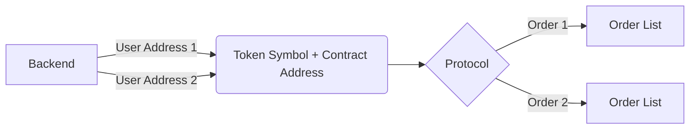
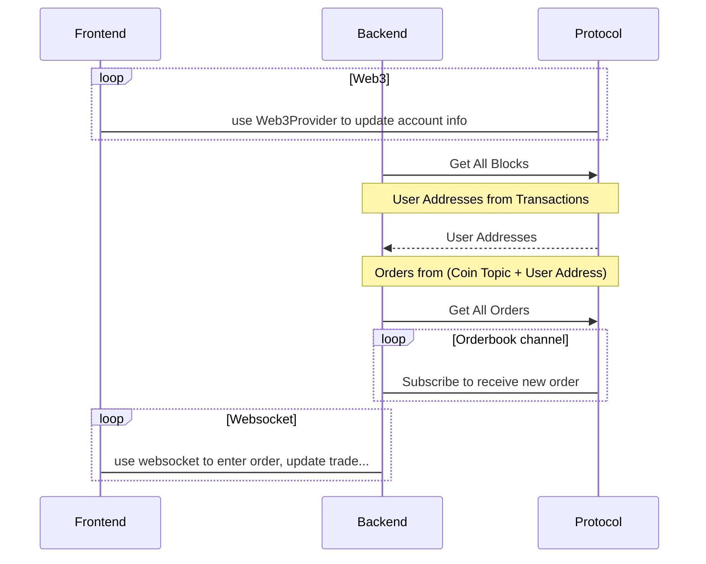
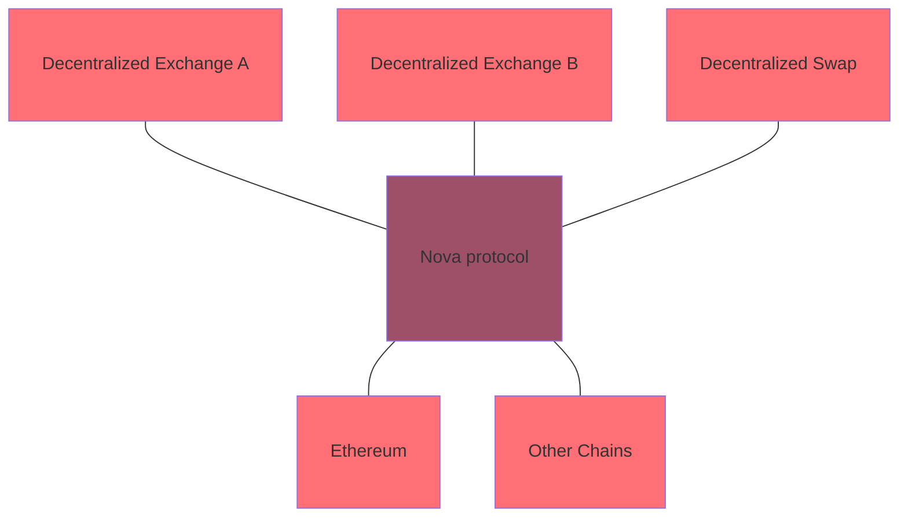
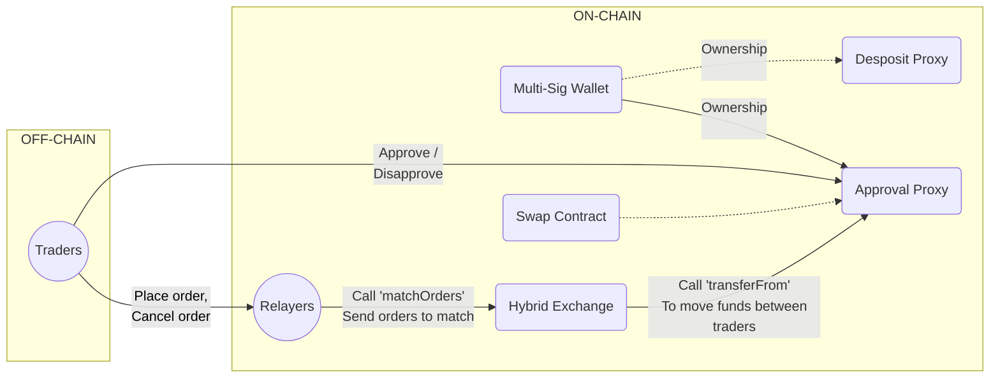

1. We use Whisper for messaging protocol and Ethereum database for data storage
2. Each market consist a pair of coin symbol and contract address as related content.
3. Each orderbook represents an market and is stored decentralized across multiple node.

## Update Order flow



**Each orderbook is a red-black tree**

```
.
├── HOT/DAI
├── WETH/DAI
│   ├── PRICE1=>[Order1, Order2, ..., OrderN]                    Order List
│   ├── PRICE2=>[...]
│   └── PRICE3=>[...]
└── NOVA/HOT
    └── PRICE1=>[...]
        ├── PRICE1_1=>[...]
        └── PRICE1_2=>[...]
            ├── PRICE1_2_3=>[...]
            ├── PRICE1_2_3=>[...]
            └── PRICE1_2_3=>[...]

```

## Overall data flow



## Architecture overview



<hr/>



## Start orderbook protocol

We have already implement orderbook as ethereum protocol and added into cmd package, so you just need to go to devnet folder.

**Node1**

```bash
go run github.com/ethereum/go-ethereum/cmd/geth/ \
  --datadir node1/ --syncmode 'full' --port 30311 \
  --rpc --rpcaddr 'localhost' --rpcport 8501 --wsport 8545 \
  --rpcapi 'personal,db,eth,net,web3,txpool,miner,orderbook' --rpc --rpccorsdomain "*" \
  --targetgaslimit 94000000 --bootnodes 'enode://6cf1b4f4391d387904c48fc18403b49d0df0588e0a20511f0ff830de30867f3e12daaf6138ccfc2583b4b76b7b5bc0b7493e1ae1cb5ae951cd1f6221b147ec50@127.0.0.1:30310' \
  --networkid 1000 --gasprice '1' --allow-insecure-unlock -unlock '0xfcc9d477af8a7fe823ecb24bbd541e779aa72f31' \
  --password node1/password.txt --mine`
```

**Node 2**

```bash
go run github.com/ethereum/go-ethereum/cmd/geth/ \
  --datadir node2/ --syncmode 'full' --port 30312 \
  --rpc --rpcaddr 'localhost' --rpcport 8502 --wsport 8546 \
  --rpcapi 'personal,db,eth,net,web3,txpool,miner,orderbook' --rpc --rpccorsdomain "*" \
  --targetgaslimit 94000000 --bootnodes 'enode://6cf1b4f4391d387904c48fc18403b49d0df0588e0a20511f0ff830de30867f3e12daaf6138ccfc2583b4b76b7b5bc0b7493e1ae1cb5ae951cd1f6221b147ec50@127.0.0.1:30310' \
  --networkid 1000 --gasprice '0' -allow-insecure-unlock --unlock '0xbd89f54c601cfee303ed61b9b5ae3be21cc09d66' \
  --password node2/password.txt --mine
```

---


---


